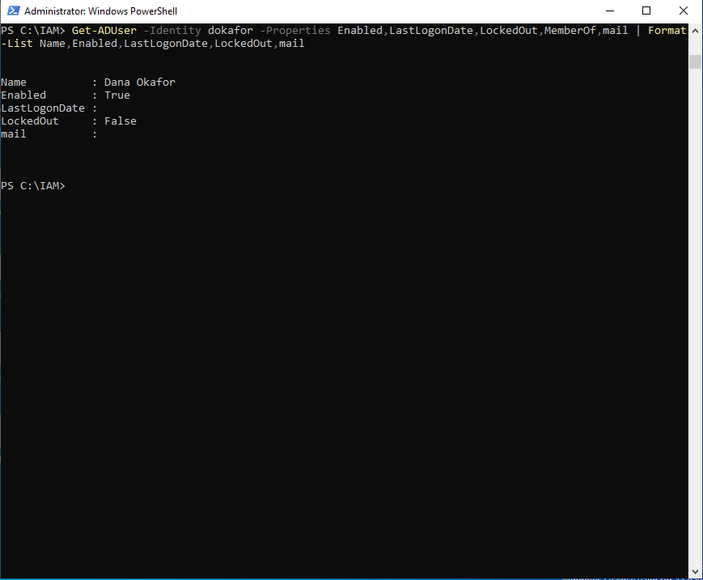

# IAM Triage Playbook — the first five minutes

Before diving into connector logs, provisioning workflows, or a 30-minute troubleshooting spiral, validate the identity object first. Most IAM issues resolve to one of a few questions about the account, and answering them up front narrows root cause in minutes.

This playbook captures the checks that experienced IAM practitioners reach for first. It reflects the real operating pattern: *check everything about the identity, then decide where to look next.*

---

## The one command that starts most investigations

```powershell
Get-ADUser -Identity <someone> -Properties *
```

This is the IAM equivalent of "let me just quickly check everything." It returns the full object, and four properties answer ~80% of day-to-day questions:

| Question | Property |
|----------|----------|
| Is this account still active? | `Enabled` |
| When did they last log in? | `LastLogonDate` |
| What groups are they in? | `MemberOf` |
| Did offboarding actually run? | `AccountExpirationDate`, `LockedOut` |

Run it before opening a runbook. It's the sanity check that confirms the user is configured the way you assume before you spend time anywhere else.

**The triage check in practice:**



### Gotcha: -Identity vs -Filter

`-Identity` only accepts **one of four unique identifiers**: distinguishedName, GUID, SID, or sAMAccountName. If all you have is an email address, or you're working from a list of thousands, `-Identity` won't help. Use `-Filter`:

```powershell
# Look up by email (mail attribute)
Get-ADUser -Filter "mail -eq 'dana.okafor@link3it.com'" -Properties mail, Enabled, LastLogonDate

# Bulk: everyone who hasn't logged in for 90+ days
Get-ADUser -Filter {Enabled -eq $true} -Properties LastLogonDate |
    Where-Object { $_.LastLogonDate -lt (Get-Date).AddDays(-90) }
```

---

## Fast snapshots from CMD

When you just want account status without opening PowerShell:

```cmd
net user <username> /domain
```

Instant snapshot: account active/locked, password last set/expires, group memberships, logon hours. Good for "is this account locked?" before you ask the next question.

---

## The hybrid truth: check BOTH directories

In a hybrid environment, **not all identities exist in both AD and Entra**, and the state in one does not guarantee the state in the other. Mapping the identity across both is how you get the complete picture.

```powershell
# On-prem
Get-ADUser -Identity dokafor -Properties Enabled, LastLogonDate, MemberOf

# Cloud (Microsoft Graph)
Get-MgUser -UserId "dokafor@link3it.com" -Property displayName,accountEnabled,signInActivity
```

A user disabled on-prem can still be enabled in the cloud if sync is broken or the account is out of scope — this is exactly the failure documented in [`tickets/TICKET-1004-incomplete-offboarding.md`](tickets/TICKET-1004-incomplete-offboarding.md). Always confirm both sides.

---

## Force a sync when you can't wait

After a change on-prem, the cloud won't reflect it until the next sync cycle. To force a delta sync from the sync server:

```powershell
Start-ADSyncSyncCycle -PolicyType Delta
```

Use this when validating an offboarding or attribute change end to end, rather than waiting for the scheduled cycle.

---

## Incident response: find the touched account

When you need to find *which* account was modified during an incident, pull everyone and filter by modified date:

```powershell
Get-ADUser -Filter * -Properties whenChanged, MemberOf |
    Where-Object { $_.whenChanged -gt (Get-Date).AddHours(-24) } |
    Select-Object Name, whenChanged | Sort-Object whenChanged
```

The same "get everything, then filter" pattern — this time to surface recent changes rather than to inspect one user.

---

## Why this matters

Identity work is mostly diagnosis, not automation. The practitioners who resolve issues fastest aren't the ones with the fanciest scripts — they're the ones who validate the object, its attributes, and its group memberships **first**, before diving into connector logs or provisioning workflows. That habit turns a 30-minute spiral into a five-minute answer.

This playbook is the front end to the rest of this repo: once triage points at the problem, the [`tickets/`](tickets/) show the full resolution for each domain, and the [`scripts/`](scripts/) handle the bulk and lifecycle work at scale.

---

*Triage patterns reflect widely-shared practice among working IAM and identity engineers. Commands are written against Active Directory / Microsoft Graph and the Link3IT lab environment.*
