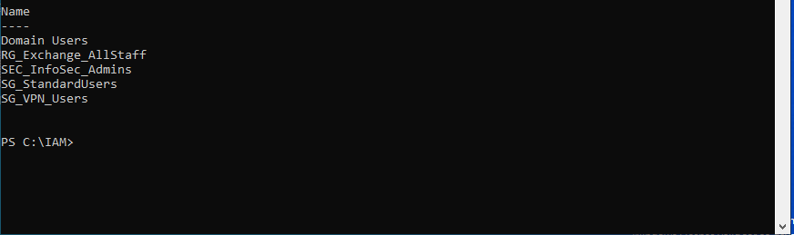
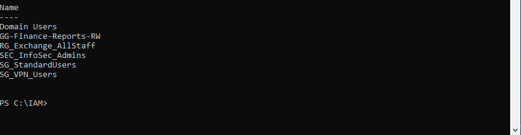

# TICKET-1001 — User cannot access departmental shared drive

| | |
|---|---|
| **Type** | Incident (Access) |
| **Priority** | P3 — Medium |
| **Status** | Resolved |
| **Domain** | File access · NTFS/Share permissions · Group membership |
| **Systems** | Active Directory, Windows File Server |

---

## Reported issue

A Finance user reported they could no longer open the `Finance-Reports` shared drive. They received "You don't have permission to access this network location" when double-clicking the mapped drive. The access had worked the previous week.

---

## Investigation

**Step 1 — Confirm the scope.** Asked whether other users in Finance had the same problem. They did not — this was isolated to one user, which points to that user's group membership rather than the share itself.

**Step 2 — Check the user's group membership.**
```powershell
Get-ADPrincipalGroupMembership dokafor | Select-Object Name | Sort-Object Name
```
The user was **not** a member of `GG-Finance-Reports-RW`, the group that grants access. They had been a member; a recent role change had swapped their groups.

**Step 3 — Confirm the group is what grants access.** Checked the effective permissions on the share folder. Access is granted to `GG-Finance-Reports-RW` (a domain global group nested into the resource's local group), consistent with an AGDLP model — accounts go in global groups, global groups nest into domain-local groups, permissions are applied to the domain-local group.

**Step 4 — Confirm the two permission layers.** File access requires **both** share permissions and NTFS permissions to allow the user; the more restrictive of the two wins. Verified the group had Change at the share level and Modify at the NTFS level, so restoring group membership would restore access.

---

## Root cause

A role change removed the user from `GG-Finance-Reports-RW`. The offboarding half of the role-change (removing old-role groups) ran, but the onboarding half (adding the groups the new role still required) was incomplete. The user's continued need for Finance-Reports access was missed.

---

## Resolution

1. Re-added the user to the correct access group:
   ```powershell
   Add-ADGroupMember -Identity "GG-Finance-Reports-RW" -Members dokafor
   ```
2. Had the user log off and back on so the new group membership was reflected in their Kerberos token (group changes do not take effect until a new token is issued).
3. Confirmed access to the share was restored.

---

## Evidence

**Before — the user is missing from the access group** (the diagnosis that found root cause):



**After — group membership restored:**



---

## Prevention

The underlying issue was a role-change process that removed old access without verifying which access the new role still needed. Recommended that role-change requests capture *net* access change (remove these, keep these, add these) rather than a blanket group swap, and that access relying on group membership be reviewed as part of the mover workflow.

**Lesson:** "It worked last week" plus "only one user affected" almost always points to that user's group membership or token, not the resource. Checking group membership first saved time that would have been wasted inspecting the share itself.
